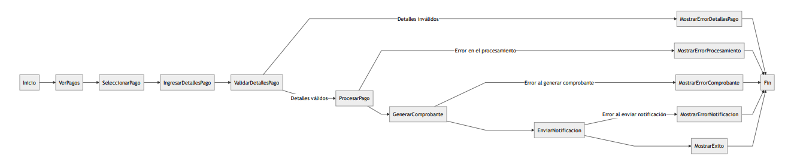

### [<-Volver Inicio](README.md)
## [Siguiente->](1.2.1.3.4.md)
## 1.2.1.3.3)Realizar pago

### Descripción :
-   **VerPagos**: El usuario accede a la sección de pagos en el sistema.
-   **SeleccionarPago**: El usuario selecciona el tipo de pago que desea realizar.
-   **IngresarDetallesPago**: El usuario ingresa los detalles necesarios para el pago.
-   **ValidarDetallesPago**: El sistema valida los detalles ingresados por el usuario.
    -   Si los detalles son inválidos, se muestra un mensaje de error y se finaliza el proceso.
    -   Si los detalles son válidos, se procede al procesamiento del pago.
-   **ProcesarPago**: El sistema procesa la transacción y realiza el cobro correspondiente.
    -   Si se produce un error en el procesamiento, se muestra un mensaje de error y se finaliza el proceso.
-   **GenerarComprobante**: El sistema genera un comprobante o recibo de la transacción.
    -   Si se produce un error al generar el comprobante, se muestra un mensaje de error y se finaliza el proceso.
-   **EnviarNotificacion**: El sistema envía una notificación al usuario confirmando el pago.
    -   Si se produce un error al enviar la notificación, se muestra un mensaje de error y se finaliza el proceso.
-   **MostrarExito**: Se muestra al usuario un mensaje de éxito indicando que el pago se ha realizado correctamente.
-   **Fin**: Fin del proceso.