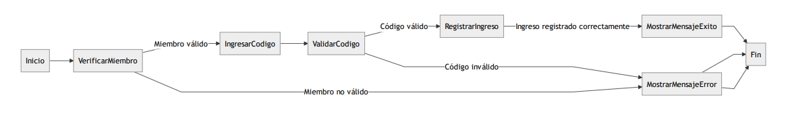

### [<-Volver Inicio](README.md)
## [Siguiente->](1.2.1.4.1.md)
## 1.2.1.3.4)Acceder al gimnasio

### Descripción :
-   **VerificarMiembro**: El usuario se acerca al área de acceso y se verifica si es miembro del gimnasio.
    -   Si el usuario es un miembro válido, se le solicita que ingrese su código de acceso.
    -   Si el usuario no es un miembro válido, se muestra un mensaje de error y se finaliza el proceso.
-   **IngresarCodigo**: El usuario ingresa su código de acceso.
-   **ValidarCodigo**: El sistema valida el código ingresado por el usuario.
    -   Si el código es válido, se procede a registrar el ingreso.
    -   Si el código es inválido, se muestra un mensaje de error y se finaliza el proceso.
-   **RegistrarIngreso**: El sistema registra el ingreso del usuario al gimnasio.
    -   Si el ingreso se registra correctamente, se muestra un mensaje de éxito y se finaliza el proceso.
-   **MostrarMensajeExito**: Se muestra al usuario un mensaje de éxito indicando que su ingreso al gimnasio ha sido registrado correctamente.
-   **MostrarMensajeError**: Se muestra al usuario un mensaje de error en caso de que ocurra algún problema durante el proceso.
-   **Fin**: Fin del proceso.