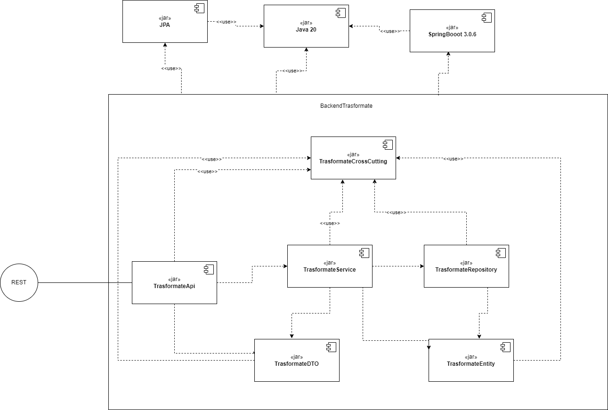

### [<-Volver](README.md)
## 1.2.3.1)Diagrama de Componentes

**TransformateCrossCutting:** Componente que ofrece características aspectuales que pueden ser utilizadas de forma general por cualquier componente de la aplicaciónTransformate. 

**TransformateDTO:** Componente que ofrece los objetos de transferencia de datos para poder intercambiar información entre el componente de API y el componente Service.  

**TransformateEntity:** Componente que tiene todas las entidades de acceso a datos que serán utilizadas por el componente de repositorio para llevar a cabo las operaciones de acceso a datos.  

**TransformateRepository:** Componente que ofrece los mecanismos de acceso a datos para el proyecto Transformate.  

**TransformateService:** Componente encargado de garantizar el cumplimiento de toda la lógica de negocio de la aplicación, asegurando que el dominio esté protegido de accesos no autorizados en la aplicaciónTransformate.  

**TransformateApi:** Componente encargado de publicar Apis relacionados con los servicios de negocio ofrecidos por la aplicación Transformate.
